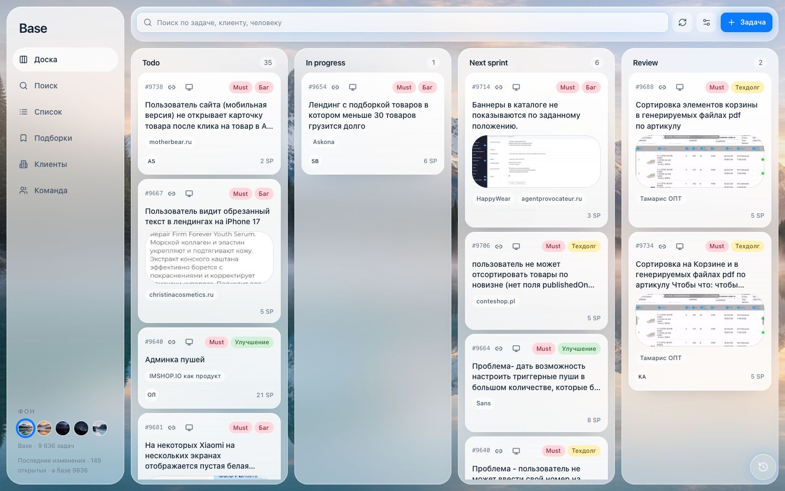
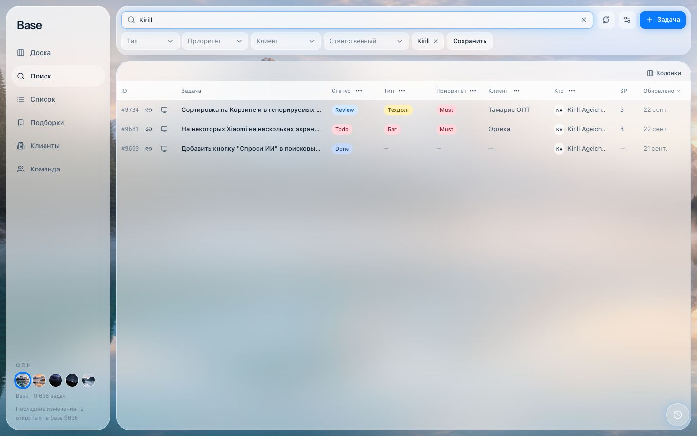
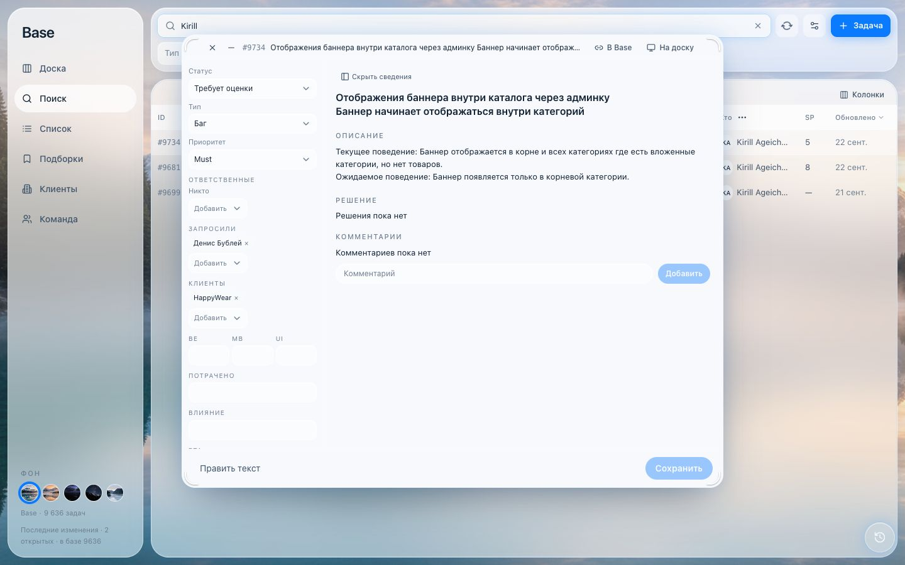
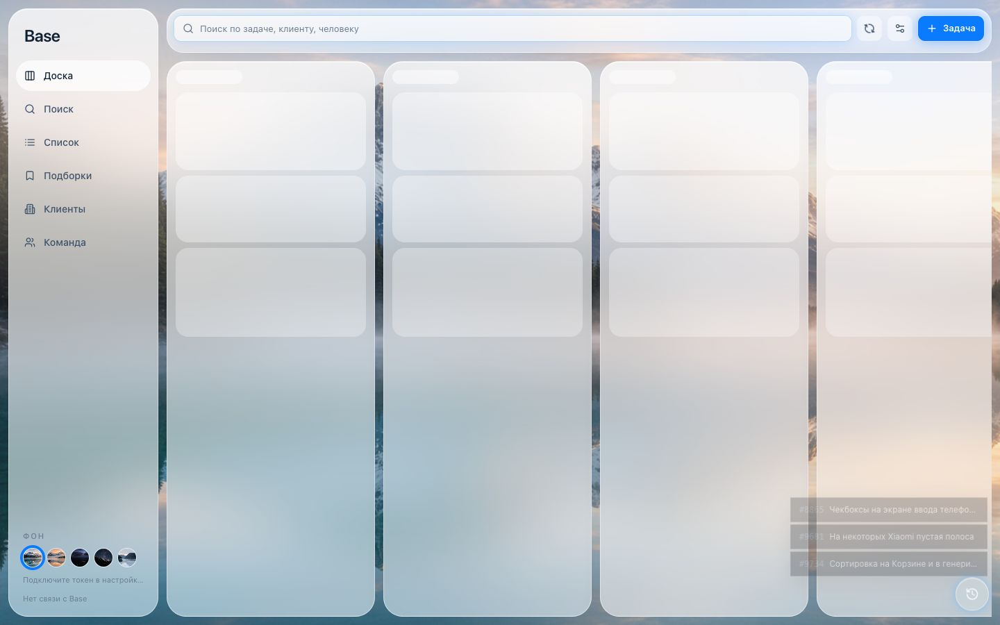
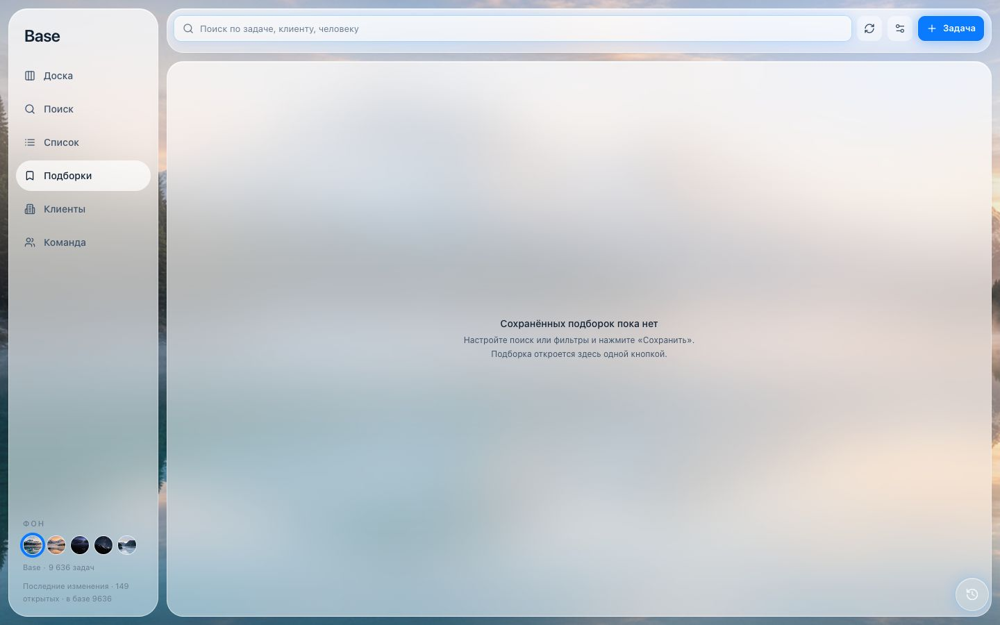

# Base

Своя доска для базы задач. Канбан, поиск, списки, клиенты и команда. Задача открывается отдельным окном: его можно двигать, растягивать и сворачивать.

## Как запустить

```bash
npm install
npm run dev
```

Без токена доска закрыта: сразу открывается окно, куда нужно вставить токен базы (Database token). Он остаётся в этом браузере и в код не попадает. Доска сама ходит в Base из браузера, своего бэкенда у неё нет. Адрес базы задаётся в `src/lib/baserow/schema.ts` (`BASEROW_ORIGIN`).

Проверка типов: `npm run typecheck`. Сборка: `npm run build`.

## Доска

На доске видны последние открытые задачи по статусам. Закрытые (Done и отменённые) сюда не попадают. Карточку можно перетащить в другую колонку.

На карточке две маленькие кнопки: ссылка на строку в базе и ссылка на эту задачу здесь.



Слева внизу пять фонов. Тёмные темы меняют и панели, не только картинку.

## Поиск и список

Поиск идёт по всей базе: название, описание, клиент, ответственный. Крестик в поле очищает запрос.

Фильтры типа, приоритета, клиента и ответственного всегда стоят под поиском, на доске и в списке тоже. У выбранного значения свой крестик. В заголовке таблицы три точки открывают чекбоксы колонки, клик по названию сортирует. «Колонки» прячет лишние поля. «Сохранить» открывает окно с именем и кладёт текущий набор в подборки.



Список — та же таблица. Фильтры сверху те же, что на доске.

## Окно задачи

Клик по задаче открывает окно поверх доски.

- Тащите за шапку.
- Тяните за белые уголки, чтобы изменить размер.
- Минус сворачивает окно в плашку внизу. Клик по плашке возвращает его.
- Esc или Ctrl+W закрывает переднее окно и не закрывает вкладку браузера.
- «Сведения» прячет левую колонку. В узком окне она уезжает сама и открывается той же кнопкой.
- Слева меняются статус, тип, приоритет, люди, клиенты, оценки и дата. Справа читается текст. «Править текст» включает заголовок, описание и решение.
- «В Base» копирует ссылку на строку в базе. «На доску» копирует ссылку вида `?view=search&task=9734`.



Окна сзади остаются стеклянными. То, с которым вы работаете, плотное, чтобы текст не смешивался с фоном.

## Недавние

Кнопка с часами справа внизу открывает стопку последних задач. Сверху вниз, ближе к кнопке — самая свежая. В начале строки номер. Клик открывает задачу и ставит её окно вперёд.



## Подборки

Подборка запоминает поиск, фильтры, сортировку и вид (доска, список или поиск). Хранится в этом браузере. Открывается одним нажатием.



## Клиенты и команда

«Клиенты» и «Команда» — справочники. Клик по имени открывает поиск по этому человеку или клиенту.

## Что где лежит

| | |
|---|---|
| Экраны | `src/components` |
| Запросы к базе | `src/lib/baserow` |
| Адрес и поля | `src/lib/baserow/schema.ts` |
| Адресная строка | `src/lib/query.ts` |
